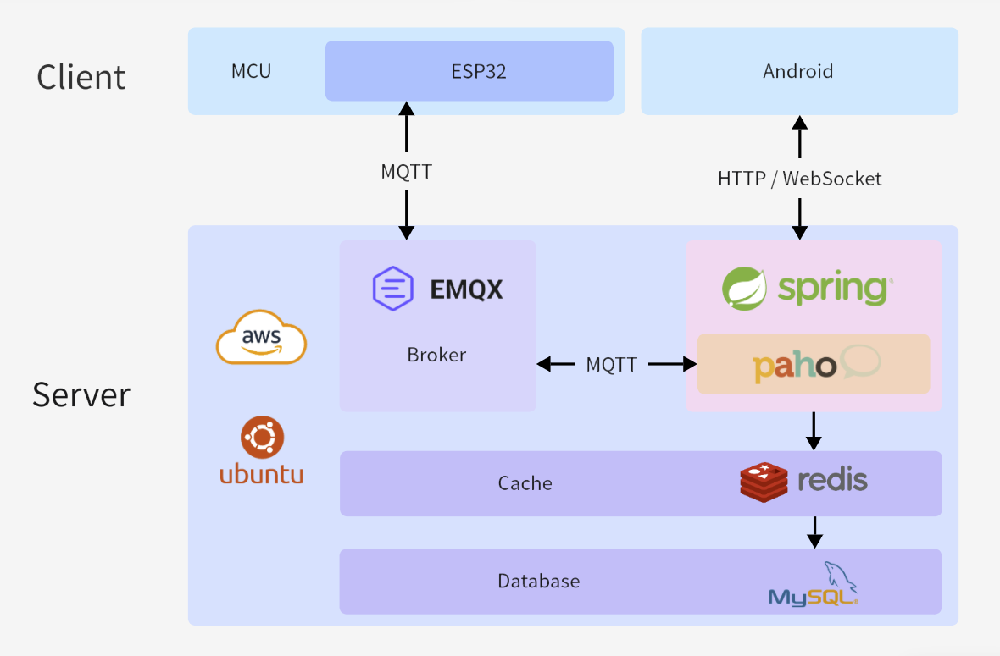
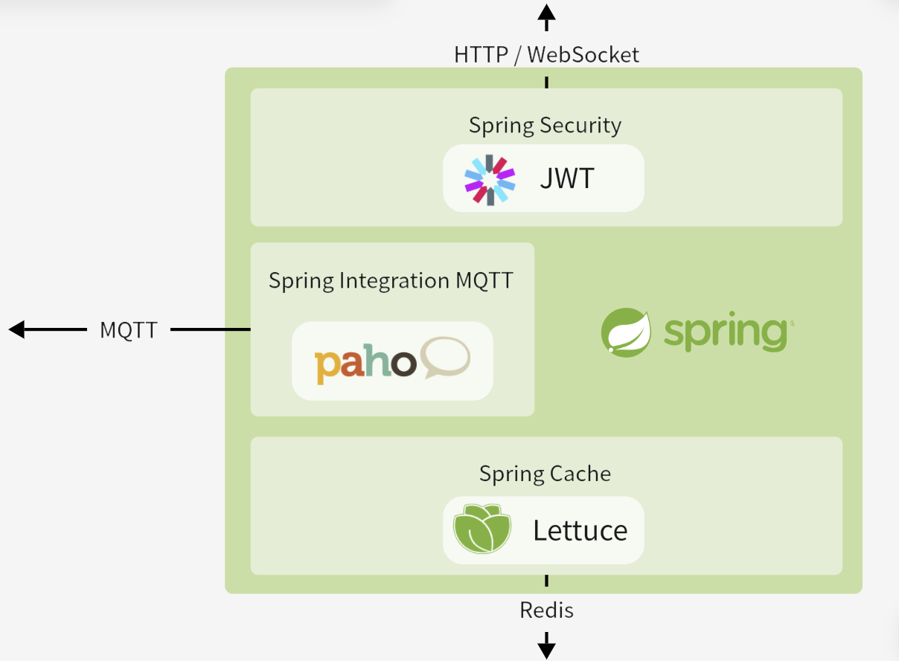

# Smart Lock Backend

基于 Spring Boot 4 的 IoT 智能门锁后端。支持 MQTT 双向通信、WebSocket 实时告警、JWT 鉴权、 TLS 加密。

## 架构图

系统整体架构图：



本后端程序架构图：



## 技术栈

- 登录鉴权：基于 Spring Security 的长短 JWT 机制
- 门锁通信：基于 Spring Integration + MQTT Topic 的多线程路由分发
- 实时告警：基于 WebSocket + STOMP 的服务端推送
- 生成临时密码：基于 Spring Boot 4 的协程（虚拟线程）+ CompletableFuture 非阻塞延迟确认。

## Quick Start

docker-compose up -d

访问 http://localhost:8080/swagger-ui/index.html

## 关键设计

代码阻塞 future.get()，底层调用协程非阻塞。

利用 MQTT v5 Header，application/json + Payload Format Indicator=True 隐式反序列化 Payload。

给 Spring Integration 提交 Issue。

在 Spring Boot 层 AOP，结合 Redis 的 SETNX 命令实现轻量防抖锁。

## API 接口文档

### App -> 后端 发送数据

http://localhost:8080/swagger-ui/index.html

#### 注册

```plaintext
POST http://localhost:8080/api/user/register
{
    "username": "alfa",
    "password": "123456",
    "email": "a@b.cd"
}
```

#### 登录

```plaintext
POST http://localhost:8080/api/user/login
{
    "username": "alfa",
    "password": "123456"
}
```

#### 查询设备

```plaintext
GET http://localhost:8080/api/device
Authorization: Bearer JWT 
```

#### 请求生成密码

```plaintext
POST http://localhost:8080/api/code
Authorization: Bearer JWT
{
    "deviceId": 10001,
    "validFrom": "2025-03-22T00:39:32.006Z",
    "validTo": "2027-03-05T00:39:32.006Z"
}
```

#### WebSocket

WebSocket 端点 /websocket

订阅 /user/queue/alert 接收设备警报

订阅 /user/queue/is-locked 接收门锁状态

## MQTT 接口文档

MQTT Broker 端口： tcp://localhost:1883

### 后端 -> ESP32(Broker) 发送数据

#### 后端生成的密码

Topic: server/10001/code QoS: 1

```json
{
  "deviceId": 10001,
  "codeId": 2054242648033824768,
  "code": "126143",
  "validFrom": "2026-05-12T16:49:47.9316483",
  "validTo": "2026-07-12T16:18:37.88"
}
```

#### 返回查询的所有密码

server/10001/all-code

```json
[
  {
    "deviceId": 10001,
    "codeId": 2054240910333612032,
    "code": "683137",
    "validFrom": "2025-03-21T17:42:54",
    "validTo": "2026-06-12T16:18:38"
  },
  {
    "deviceId": 10001,
    "codeId": 2054242308450390016,
    "code": "680949",
    "validFrom": "2025-03-21T16:48:27",
    "validTo": "2026-07-12T16:18:38"
  }
]
```

### ESP32 -> 后端(Broker) 发送数据

username: admin

password: alice123456

#### 更新门锁状态

device/10001/status

```json
{
  "deviceId": 10001,
  "isLocked": true
}
```

#### 确认收到密码

device/10001/code

```json
{
  "deviceId": 10001,
  "codeId": 2054242648033824768,
  "code": "替换成收到的code"
}
```

#### 发送警报

device/10001/alert

```json
{
  "deviceId": 10001,
  "type": "MOTOR"
}
```

> 电机坏了写：MOTOR
>
> 指纹坏了写：FINGERPRINT
>
> 屏幕坏了写：SCREEN
>
> 灯泡坏了写：LIGHT

#### 获取密码

device/10001/all-code

```json
{
  "deviceId": 10001
}
```
