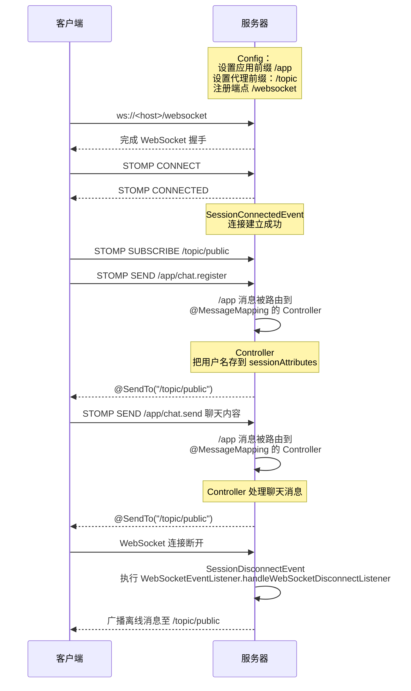

## App -> 后端 发送数据

接口文档

http://63.32.52.62/swagger-ui/index.html

### 查询设备

```http request
http://63.32.52.62/api/device
```

### 请求生成密码

```http request
http://63.32.52.62/api/code
body:
{
    "deviceId": 10002,
    "validFrom": "2025-03-22T00:00+08:00",
    "validTo": "2027-03-05T00:30+00:00"
}
```

## ESP32 -> Broker 发送数据

192.109.228.41:1883

username: alice

password: alice123456

### 更新状态

device/lock

```json
{
  "deviceId": "10002",
  "isLocked": true
}
```

### 确认收到密码

device/lock/code

```json
{
  "deviceId": "10002",
  "codeId": "${收到的codeId}",
  "code": "${收到的code}"
}
```

### 发送警报

device/lock/alert

```json
{
  "deviceId": "10001",
  "type": "MOTOR"
}
```

## 后端 -> ESP32(Broker) 发送数据

### 生成的密码

server/lock/code

```json
{
  "code": "645941",
  "codeId": 1893389214167859200,
  "deviceId": 10002,
  "validFrom": "2025-03-22T00:00+08:00",
  "validTo": "2026-02-22T00:00+08:00"
}
```


